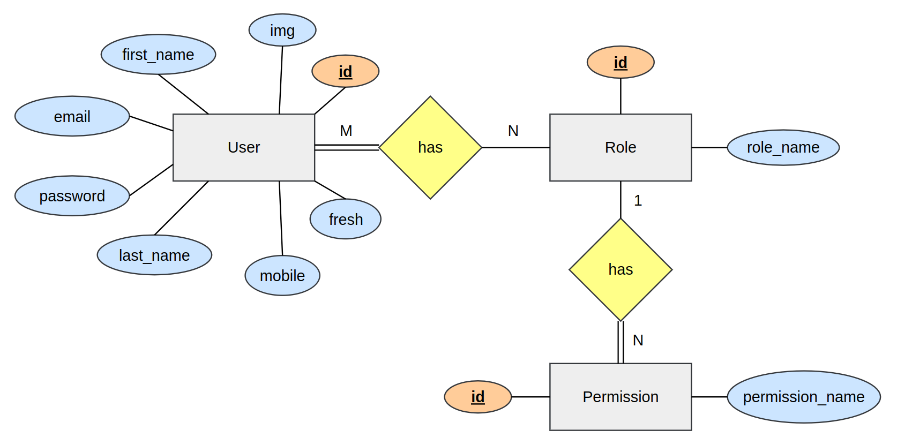

# Use Authenticator Application Back End 

This is the **Back End** of the **mobile-responsive web-based user authentication system.** 
Upon registration, users gain access to the system where their **assigned roles and permissions** dictate the functionalities available to them. 
For instance, a guest user is restricted from performing operations within the system and is limited to viewing details exclusively.

#### Key features of the system,

- The Super Administrator, serving as the system's primary authority, possesses comprehensive access across all functionalities within the system.

- Registered users have the capability to assume multiple roles, each of which may entail various permissions within the system. Upon logging in, a user can view their assigned roles and associated permissions within the Profile section.

- The system accommodates an unlimited number of users and roles, ensuring scalability and adaptability to organizational needs.

- Users hold exclusive authority over changing their own passwords. However, the Super Administrator retains the ability to reset a user's password, triggering the issuance of a temporary password sent via email. The user can then employ this temporary password to reset their password securely.

**Front End** of the project can be visited by clicking [**here.**](https://github.com/PubuduJ/user-authenticator-app-front-end)

#### ERD of the database

## Used Technologies

- Java SE 17
- Spring Boot 3.0.5
- Apache Maven 3.9.2
- MySQL Community Server 8.0.33
- Added dependencies to pom.xml
    - spring-boot-starter-web
    - spring-boot-starter-data-jpa
    - spring-boot-starter-validation
    - spring-boot-starter-security
    - spring-boot-starter-aop
    - spring-boot-starter-mail
    - spring-boot-starter-test
    - spring-boot-devtools
    - lombok
    - mysql-connector-java 8.0.33
    - springdoc-openapi-starter-webmvc-ui 2.0.4
    - modelmapper 3.1.0
    - jjwt-api 0.11.5
    - jjwt-impl 0.11.5
    - jjwt-jackson 0.11.5

#### Used Integrated Development Environment
- IntelliJ IDEA

## How to use ?
- This project can be used by cloning the project to your local computer.
- Clone the project using `https://github.com/PubuduJ/user-authenticator-app-back-end` terminal command.

## Version
v1.0.0

## License
Copyright &copy; 2023 [Pubudu Janith](https://www.linkedin.com/in/pubudujanith/). All Rights Reserved. 
This project is licensed under the [MIT license](LICENSE.txt).
